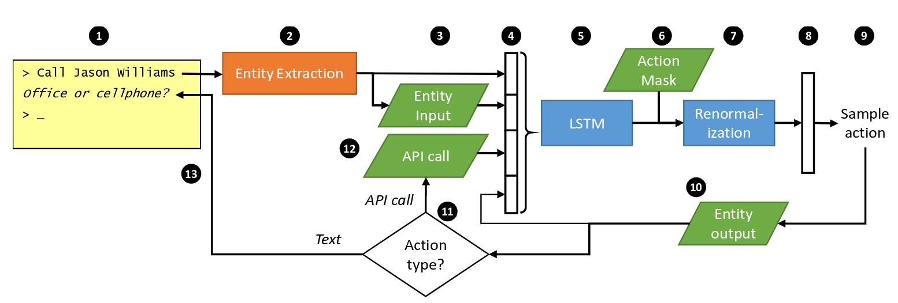

# End-to-end LSTM-based dialog control optimized with supervised and reinforcement learning

MS Research

[arXiv](https://arxiv.org/abs/1606.01269)

## Field

NLP, Machine Learning, Neural Network, Reinforcement Learning

## Purpose

ビジネスルールの実行を伴う，
タスク指向対話システムにおけるEnd-to-endな学習モデルの提案

## Former

state trackingとaction selectionの実装に関して，
* hand-crafted state representation
* action selection
  - hand-crafting - スキルが必要．データから直接学習出来ない．
  - supervised learning - エンドユーザとのやり取りで学習出来ない．
  - reinforcement learning - デバッグが難しい．学習の初期段階で性能が出ない．

## Breakthrough

dialog historyの表現を自動獲得出来るようになった．

## Challenge

stateの設計に関して手作業が必要であることを改善したい．

## Approach

RNNで実現される3つのコンポーネント

* targeted and well-encapsulated
* software implementing domain specific functions
* 言語理解モジュール

RNNは内部状態を持つため履歴の蓄積が可能であり，
Actionの選択に役立つ特徴を含むため，Actionの選択責務を負う．
Actionはテンプレートから選ぶ．

## Theorem

1. ユーザ入力 (type or speech)
2. Entity Extraction (名詞などのActionに必要な情報をマーキング)
3. Entity Input (2で得られた情報をDBに格納してIDに変換する?)
4. 特徴ベクトル作成 (2の結果から，持っている情報一覧のBoolean Vectorに変換，3の結果と結合する)
5. RNN-softmax = LSTM (全てのtemplate actionsの確率分布を出力．Entity namesは置換しておく)
6. actionの実行許可のマスクベクトルを入力
7. マスクのかかった分布に変換して，許可が無いactionの確率を0にする
8. 最正規化(結果ベクトルを確率分布に変換？)
9. 得られた分布からactionを選択 (RLがactiveなら探索，not activeなら最大の確率のものを選ぶ)
10. Entity outputを作成し，次のフレームのLSTMに入力
11. outputがAPI callならば12へ，それ以外は13へ
12. API call割り込みを発生させ，結果を次のフレームのLSTMに入力
13. ユーザにテキストを表示して1へ

### state tracking

* ユーザのゴールを追跡
* dialog historyを考慮した出力を行うために必要(既出の内容を出さない・確認応答など)

Dialog State Tracking Challenge(DSTC)
事前に取り決めたname/valueペアフレームがユーザのゴールを形成する．
stateの更新方法はRNNで学習している．
追跡されていたschema of the stateは手作り．

提案手法「automatically infers a representation of dialog history」 in RNN
効率的なstate空間の設計は非常に多くの人でを要する．
省略は偽信号(乱れ)を発生させ，偽の特徴は学習を遅くする．
そのため，これと対話方針最適化は開発者の仕事を簡素化する．

stateとentitiesを分割して追跡することで，訓練データに出現しないentitiesにも対応可

action maskingとAPI callsのファーストクラスサポート
=> ビジネスルールのエンコードと，実世界の行動をシステムに代わって行うことができる．

### action selection

ネットワークを教師有り学習と強化学習を用いて最適化する．

1. RNN <= SL (training dialogs)
2. RNN <= RL (reward signal)

